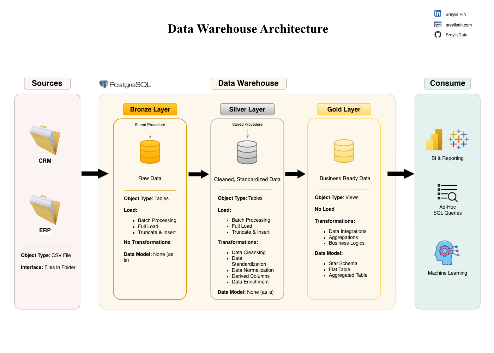

# Data Warehouse Project 

This project showcases an end-to-end data warehousing and analytics workflow—from constructing a **PostgreSQL** data warehouse to delivering meaningful insights. It demonstrates strong adherence to data engineering and data analytics best practices, including **data architecture, ETL pipeline development, data modeling, and analytical reporting.**

I developed this project to strengthen and showcase my skills in data engineering and data analytics. It highlights my ability to turn raw data into reliable, analysis-ready datasets and produce insights that support operational and business decisions—key skills for roles in **Data Analytics, BI, Data Engineering, and Database Development.**

---
## 🏗️ Data Architecture

The data architecture for this project follows Medallion Architecture **Bronze**, **Silver**, and **Gold** layers:

1. **Bronze Layer**: Stores raw data as-is from the source systems. Data is ingested from CSV Files into PostgreSQL Database.
2. **Silver Layer**: This layer includes data cleansing, standardization, and normalization processes to prepare data for analysis.
3. **Gold Layer**: Houses business-ready data modeled into a star schema required for reporting and analytics.

---
## 📖 Project Highlights

**This project involves:**

1. **Data Architecture**: Building a modern data warehouse using the Medallion Architecture with **Bronze**, **Silver**, and **Gold** layers.
2. **ETL Pipelines**: Extracting, transforming, and loading data from source systems into a structured warehouse.
3. **Data Modeling**: Designing fact and dimension tables optimized for BI and analytical queries.
4. **Analytics & Reporting**: Creating SQL-based reports and dashboards that support data-driven decision-making.
   
**Technical skills demonstrated:**
- SQL Development
- Data Engineering  
- ETL Pipeline Development
- Data Architecture
- Data Modeling (Star Schema)
- Data Quality & Data Cleaning
- Data Integration 
- Data Analytics & Reporting
- Documentation for technical + business stakeholders 

---

## 🔗 Important Links & Tools:

- **[Datasets](datasets/):** Access the project datasets (csv files).
- **[Notion Project Steps](https://www.notion.so/sreylisrin/Data-Warehouse-Project-24c061488edd80ef98eac5bf6336d7a8?source=copy_link):** Access the project tasks.
---

## 🚀 Project Requirements

### Building the Data Warehouse (Data Engineering)

#### Objective
Develop a modern data warehouse using PostgreSQL to consolidate sales data, enabling analytical reporting and informed decision-making.

#### Specifications
- **Data Sources**: Import data from two source systems (ERP and CRM) provided as CSV files.
- **Data Quality**: Cleanse and resolve data quality issues prior to analysis.
- **Integration**: Combine both sources into a single, user-friendly data model designed for analytical queries.
- **Scope**: Focus on the latest dataset only; historization of data is not required.
- **Documentation**: Provide clear documentation of the data model to support both business stakeholders and analytics teams.
  
---
## 📩 Stay Connected

Hello, I'm **Sreylis**! I'm a Data Analyst who untilize data to tell stories, solve problems, and guide meaningful decisions. 
Let's stay in touch! Feel free to connect with me on the following platforms:

